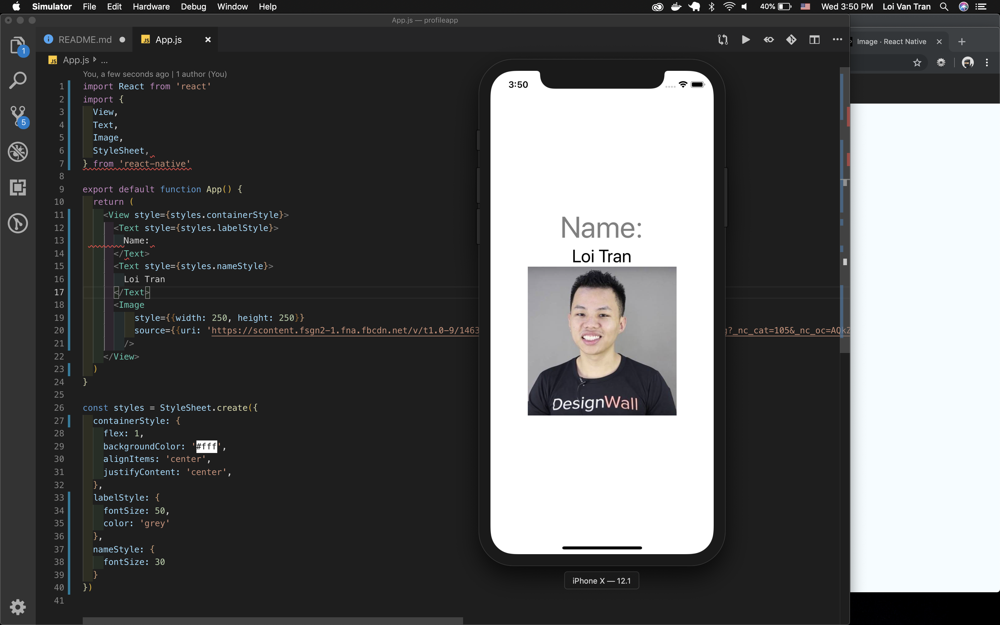

# WK2 - HW - **Hello World Profile App 🌎**

## Introduction 🌟

We're going to build our first mobile app 📱 using [React Native](https://facebook.github.io/react-native/). We'll be using [Expo](https://expo.io/) to move quick 🏎️. Our app will say hello 🙋‍to not only our friends 🤼‍ & family 👨‍👩‍👧‍👦 but the world 🌎.


### Features 🎯🥇🏆

- [ ] User can see our name.
- [ ] User can see our age.
- [ ] User can see our birthday.
- [ ] User can see our profile picture.
- [ ] User can see where we currently live.

### Learning Objectives ✍️📚📝

1. Learn how to create a new mobile app 📱using React Native & Expo:
    - Recognize it's one of many folders 🗂on our computer containing additional **folders** 📂 & **files** 📑. These folders and files combine to be the **ingredients**  🍚🥦🍗🌶of our mobile app 📲 **receipe** 🥘🍲🍛.
2. Learn that `App.js` is a component like all other components, albeit, special 👑:
    - Recognize it's **composition** 🎶 will demonstrate how to **build** 🏗👷**our own** components.
3. Learn that nesting components inside of `App.js` is how we'll build all our apps 📱: 
    - Recognize it will one day become the [parent component](https://stackoverflow.com/questions/44092105/what-is-the-difference-between-child-and-parent-component-in-angular-2) of all other components in our applications. This will happen through **nesting**. Some components will be parents 👫 and others will be their children 👨‍👩‍👧‍👦.
4. Learn that passing **properties** to components changes their **behavior** the way arguments to a function call change the return value:
    - Recognize that some components are classified as [functional](https://www.robinwieruch.de/react-function-component/). Like functions, the **properties/props/params/arguments** we pass them will effect their behavior.

No company you work at will expect you to work alone or without the help of resources available. We suggest you work in pairs and Google not only now but in future lessons.

> **Tip** 💡: The links provided throughout all lessons will provide valuable information to you in class and your careers. It isn't a bad idea to spend a few minutes reading them before moving forward.

### **Milestone 1 🛣🏃 Create project directory and run application locally using Expo and simulator**

**A)** Open your terminal and navigate to the place you'll want to keep all the apps you'll build in the future saved on your computer. In my case it happens to be:

```terminal
/Users/primetimetran/Desktop/coderschool
```


**B)** Run `expo init profileapp` in your terminal window. This command uses the [Expo CLI](https://docs.expo.io/versions/v33.0.0/workflow/up-and-running/) to create a folder which will contain all the files for this project, our `profileapp`. If you can't run the command consult [it's documentation](https://docs.expo.io/versions/v33.0.0/introduction/installation/), you may need other dependencies on your computer such a [node](https://nodejs.org/en/) or [npm](https://www.npmjs.com/).


**C)** When prompted, select:

> 'blank' minimal dependencies to run and an empty root component

and press `enter`.

**D)** Now enter the name for the project again. This name should reflect what you'd call this on the App & Play stores.


**E)** Enter `y` and hit enter when you're prompted to install using yarn.


**F)** If everything went well, you should see a prompt/screen like this in your terminal window.
```
To get started you can type:
    cd profileapp
    yarn start
```


**G)** Move into the project by typing `cd profileapp`. Remember, it's just a folder on your computer.


**H)** We expect this step to have problems for many of you. Try running `expo start`. If you're setup already, you should see your simulator open and a screen that looks like this.


---
> **Tip** 💡: If you run into problems such as the simulator not opening, error messages, etc, refer to the documentation found at [https://docs.expo.io/versions/v33.0.0/introduction/installation/](https://docs.expo.io/versions/v33.0.0/introduction/installation/) and try figuring it out **yourself**. You'll want to know how to do this yourself in the future, trust us. Additionally, a reasonable expectation that your future teammates and boss will have is that you can **indepdently troubleshoot** problems by **reading publically available documentation** and **following recommended steps**.

---
> **Key Points** 🔑📝

- We can create a new mobile app from the command line. When we run `expo init app-name` Expo creates a folder on our computer  that matches 'app-name' where all the files required for this app are. The **sky** is the limit.

---

### **Milestone 2 🛣🏃 Open ./App.js in your code editor and examine it**

All your applications will have the `App.js` file/component as the parent of all other components. It came free with React Native. This component is the work of not only the engineers at [Facebook](https://www.facebook.com/) but engineers around the world.

<details>

<summary>App.js contents</summary>

```jsx
import React from 'react';
import { StyleSheet, Text, View } from 'react-native';

export default function App() {
  return (
    <View style={styles.container}>
      <Text>Open up App.js to start working on your app!</Text>
    </View>
  );
}

const styles = StyleSheet.create({
  container: {
    flex: 1,
    backgroundColor: '#fff',
    alignItems: 'center',
    justifyContent: 'center',
  },
});
```

</details>


**A)** Check out the top section:

```jsx
import React from 'react';
import { StyleSheet, Text, View } from 'react-native';
```

These lines use [ES6 import, export, and default syntax](https://hackernoon.com/import-export-default-require-commandjs-javascript-nodejs-es6-vs-cheatsheet-different-tutorial-example-5a321738b50f) to grab React and some components provided for free from React Native.

We could additionally import additional components that are part of React Native, spoiler, `Image`, our own custom components, and components from public libraries such as open source projects.

**B)** We can see the definition of our `App` component here:

```jsx
export default function App() {
  return (
    <View style={styles.container}>
      <Text>Open up App.js to start working on your app!</Text>
    </View>
  );
}
```

The team has done a few things here.
- They name the component to correspond to the file's name, `App.js`.
- They define `App` as the [default export](https://stackoverflow.com/questions/21117160/what-is-export-default-in-javascript) of this file, `App.js`.
- They define the body of `App` with the `{}`.
- They `return` JSX in the `()`.
- They have a `View` parent  🤰component that has a child 👼 `Text` component nested.

**C)** We style our application at the bottom. We see that we use StyleSheet's `create()` method and pass it an argument. The argument to it is an object. The object has keys whose values are other objects. This is where we'll style 💅.

```jsx
const styles = StyleSheet.create({
  container: {
    flex: 1,
    backgroundColor: '#fff',
    alignItems: 'center',
    justifyContent: 'center',
  },
});
```

---
> **Key Points** 🔑📝

- We can import components for use at the top of our files.
- We can create components by writing functions which return JSX.
- We can nest components inside of one another.
- We can style our components just like HTML.

---

### **Milestone 3 🛣🏃 Begin building 👷🏗🏭**

Let's get going on building that saying hello world.

**A)** Print your name to the screen:

```jsx
export default function App() {
  // Use your own name
  return (
    <View style={styles.container}>
      <Text>Loi Tran</Text>
    </View>
  );
}
```


Sweet, now the user can see our name, but this could be improved. How do they know what they're looking at?

**B)** Add a description to our name:

```jsx
export default function App() {
  return (
    <View style={styles.container}>
      <Text>Name:</Text>
      <Text>Loi Tran</Text>
    </View>
  );
}
```


Now we've got two `sibling` `Text` components, interesting. Our text is quite small. Also, the two pieces of text are fundamentally different in what they're displaying. We should treat them so.

**C)** Change the styling of the `Text` components to reflect their purpose.

```jsx
export default function App() {
  return (
    <View style={styles.container}>
      <Text
        style={{
          fontSize: 50,
          color: 'grey'
        }}
      >
        Name:
      </Text>
      <Text
        style={{
          fontSize: 30
        }}
      >
        Loi Tran
      </Text>
    </View>
  )
}
```


If you see a screen like this you've done well. You've added a child component to `App.js` of `Text`. There are now two `Text` siblings. We've also passed them `style` props, these props affected the way these components behaved in terms of styling.

---
> **Tip** 💡: We'll show you different syntaxs so you know additional techniques.

---

#### Different Styles 💋👔⌨

<details>
<summary>Option 1</summary>

```jsx
import React from 'react'
import { 
  View, 
  Text,
  Image,
  StyleSheet,
} from 'react-native'

export default function App() {
  return (
    <View style={styles.containerStyle}>
      <Text style={styles.labelStyle}>
        Name:
      </Text>
      <Text style={styles.nameStyle}>
        Loi Tran
      </Text>
    </View>
  )
}

const styles = StyleSheet.create({
  containerStyle: {
    flex: 1,
    backgroundColor: '#fff',
    alignItems: 'center',
    justifyContent: 'center',
  },
  labelStyle: { 
    fontSize: 50,
    color: 'grey' 
  },
  nameStyle: {
    fontSize: 30
  }
})


```

</details>
<details>
<summary>Option 2</summary>

```jsx
import React from 'react'
import { 
  View, 
  Text,
  Image,
  StyleSheet,
} from 'react-native'

export default function App() {
  const { labelStyle, containerStyle, nameStyle } = styles
  return (
    <View style={containerStyle}>
      <Text style={labelStyle}>
        Name:
      </Text>
      <Text style={nameStyle}>
        Loi Tran
      </Text>
    </View>
  )
}

const styles = StyleSheet.create({
  containerStyle: {
    flex: 1,
    backgroundColor: '#fff',
    alignItems: 'center',
    justifyContent: 'center',
  },
  labelStyle: { 
    fontSize: 50,
    color: 'grey' 
  },
  nameStyle: {
    fontSize: 30
  }
})

```

</details>

**D)** Grab the `Image` component from React Native and add a profile image so the user can see you. Make sure to replace the `uri` part with a publically available image of yourself(I used Facebook).

```jsx
export default function App() {
  return (
    <View style={styles.containerStyle}>
      <Text style={styles.labelStyle}>
        Name:
      </Text>
      <Text style={styles.nameStyle}>
        Loi Tran
      </Text>
      <Image
          style={{width: 250, height: 250}}
          source={{uri: 'https://scontent.fsgn2-1.fna.fbcdn.net/v/t1.0-9/14633014_10154745913714359_6100717154322258576_n.jpg?_nc_cat=105&_nc_oc=AQkZMdfzPzbxiGhHk7rKdxZuqxfru6om8cUXLPi4elQn9yH-qtyHT1jMm8_wF2g-kp8&_nc_ht=scontent.fsgn2-1.fna&oh=0a07f00a2483ba1090d5010e8cd1eb64&oe=5DC1478A'}}
        />
    </View>
  )
}
```


We grabbed `Image` from React Native. We nested it inside our single `View` as a child. `Image` has two sibling `Text` components. We also passed `Image` a new type of property we haven't seen before, `source`. This prop is passed an object. The object has a key or `uri` where the value is a `String` which is the URL of the image. 

**E)** Add other details about ourselves
```jsx
return (
    <View style={styles.containerStyle}>
      <Text style={styles.labelStyle}>
        Name:
      </Text>
      <Text style={styles.nameStyle}>
        Loi Tran
      </Text>
      <Image
        style={{width: 250, height: 250}}
        source={{uri: 'https://scontent.fsgn2-1.fna.fbcdn.net/v/t1.0-9/14633014_10154745913714359_6100717154322258576_n.jpg?_nc_cat=105&_nc_oc=AQkZMdfzPzbxiGhHk7rKdxZuqxfru6om8cUXLPi4elQn9yH-qtyHT1jMm8_wF2g-kp8&_nc_ht=scontent.fsgn2-1.fna&oh=0a07f00a2483ba1090d5010e8cd1eb64&oe=5DC1478A'}}
      />
      <Text style={styles.labelStyle}>
        Age:
      </Text>
      <Text style={styles.nameStyle}>
        18
      </Text>      
      <Text style={styles.labelStyle}>
        Birthday:
      </Text>
      <Text style={styles.nameStyle}>
        July 22th, 2000
      </Text>
      <Text style={styles.labelStyle}>
        Location
      </Text>
      <Text style={styles.nameStyle}>
        Ho Chi Minh City, Vietnam
      </Text>
    </View>
  )
```


Now the user knows something about us, amazing 🍾🎉. It seems weird the way name and age are so small yet take up an entire row though. Let's fix this in the next step

**F)** Make name and age fit on the same row using [Flexbox](https://css-tricks.com/snippets/css/a-guide-to-flexbox/). Add the following to the return of the `App` component:

```jsx
// ... code ...
  <View 
    style={{ 
      width: '100%',
      flexDirection: 'row',
      alignItems: 'center',
      justifyContent: 'space-around'
    }}
  >
    <Text style={styles.labelStyle}>
      Name:
    </Text>
    <Text style={styles.infoStyle}>
      Loi Tran
    </Text>
    <Text style={styles.labelStyle}>
      Age: 
    </Text>
    <Text style={styles.infoStyle}>
      18
    </Text>
  </View>
```


Sweet, now we know how to layout things top to bottom as well as left to right. Do you know how we could get it to go bottom to top or right to left? If not, then spend a few minutes [watching this video](https://www.youtube.com/watch?v=-xFF5KF-KpE&t=293s). The author watched it himself as a young programmer =)

---

> **Key Points** 🔑📝

- We can nest components to create visual elements in `App.js` like labels, text, and images.

- We can pass properties as necessary to components to change their behavior/layout.

- We can see that different components can receive different props, think about the responsibilities of `source` and `style`.

---

## Review 💻🤓🤔

- Any app consists of a folder 🗂on our computer containing folders 📂 & files 📄📑 which have different responsibilities 🗝🎉.

- `App.js` will be a component in every app we build. Understanding `App.js`'s composition 🎹🎼 helps us understand the building blocks 👷‍🏗 of all future components.

- `App.js` will  one day become the [parent 👩‍👧](https://stackoverflow.com/questions/44092105/what-is-the-difference-between-child-and-parent-component-in-angular-2) component of all other components in our applications. This will happen through nesting. Some components will be parents 👫 and others will be their children 👨‍👩‍👧‍👦.

- Understand some components are classified as [functional](https://www.robinwieruch.de/react-function-component/). Like functions, `functional components` accept props/params and will behave differently due to said props/params.

### Accomplishments 🥇🏆💯

- [X] User can see our name.
- [X] User can see our age.
- [X] User can see our birthday.
- [X] User can see our profile picture.
- [X] User can see where we currently live.

### Rockets 🚀

- [ ] Make this your Hello World to React Native. Add a title to your App.
- [ ] Make the avatar circular and give it some additional styling such as a border.
- [ ] Space out the 'Hello World', avatar, & info to maximize use of valuable screenspace.
- [ ] Add a description. Write/build your very own `Description` component above `App.js` by nesting other components in it. Style it by passing props. Nest/Render it inside of `App.js`.

<details>

<summary>Hint</summary>

```jsx
const Description = () => {
  return (
    <View
      style={{
        margin: 10,
        height: 100,
        padding: 10,
        width: '90%',
        borderWidth: 3,
        borderColor: 'red',
      }}
    >
      <Text style={styles.labelStyle}>Description</Text>
      <Text>I like writing code 💻 and building mobile apps 📲</Text>
    </View>
  )
}
```

</details>

##### It should look like this
