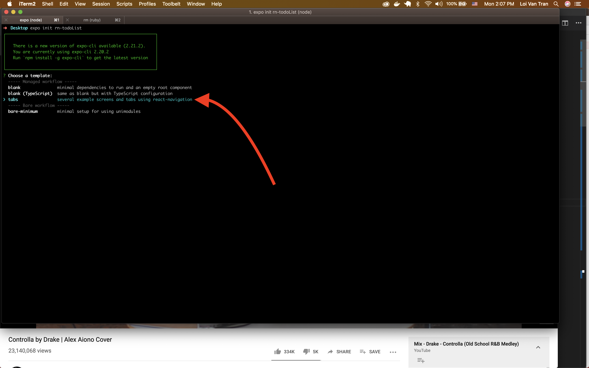
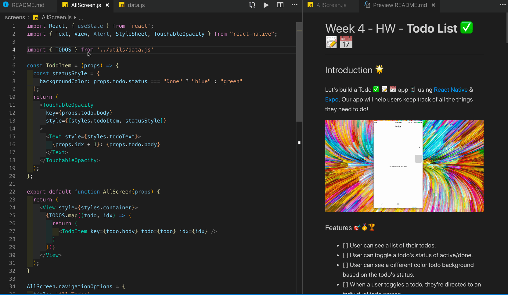
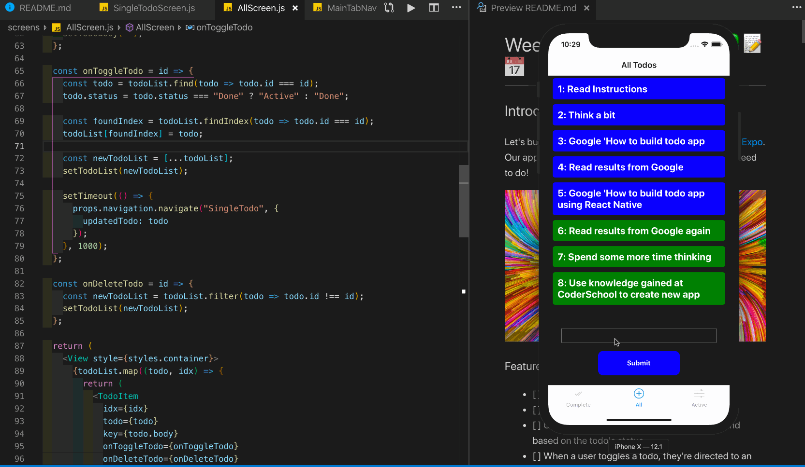
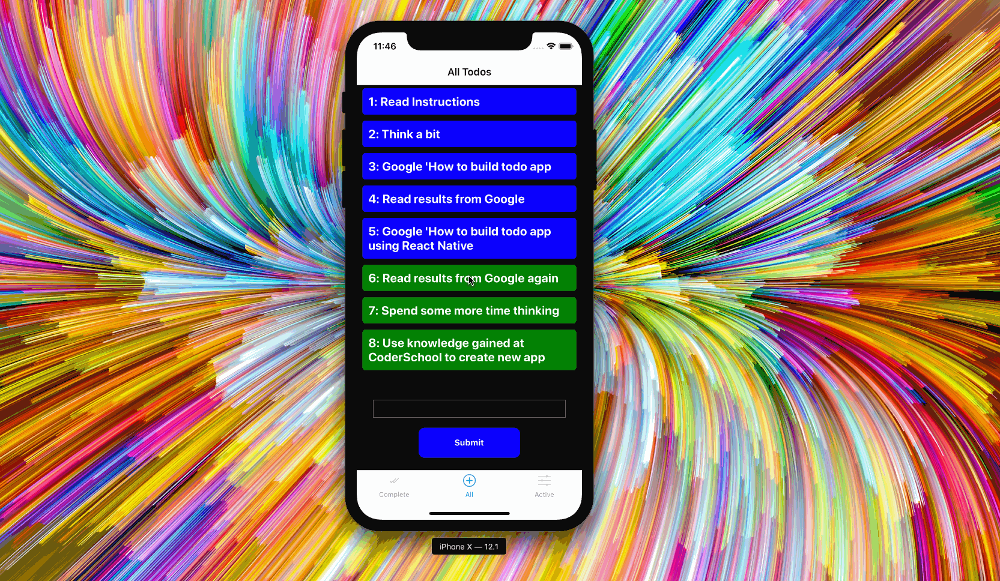

# Week 4 - HW - **Todo List ✅ 📝 📅**

## Introduction 🌟

Let's build a Todo ✅ 📝 📅 app 📱 using [React Native](https://facebook.github.io/react-native/) & [Expo](https://expo.io/). Our app will help users keep track of all the things they need to do!


### Features 🎯🥇🏆

- [ ] User can see a list of their todos.
- [ ] User can toggle a todo's status of active/done.
- [ ] User can see a different color todo background based on the todo's status.
- [ ] When a user toggles a todo, they're directed to an individual todo screen.
- [ ] User can delete a todo by long pressing it and being prompted to confirm their action.
- [ ] User can cancel deleting a todo.
- [ ] User can slide the todos list to see the entire app wallpaper.
- [ ] If the user's todo list is too long, they can continue scrolling so they can see the input to add a new todo.
- [ ] User can add a new todo by entering it and submitting.
- [ ] User will see the input reset when they submit their todo.
- [ ] User can see what number a todo is.

### Learning Objectives ✍️📚📝 ️

1. Learn how to setup multiple screens on an app.
2. Learn how to navigate users **up** & **down** a [stackNavigator](https://reactnavigation.org/docs/en/stack-navigator.html).
3. Learn how to pass data from one screen to another screen.
4. Learn how to customize transitions between screens.

> **Tip** 💡: Screens give us a way to provide a lot of content to our users for their consumption whether it's for work or play. Structuring the screens in a meaningful and easily understood way is called [information architecture](https://en.wikipedia.org/wiki/Information_architecture).

### **Milestone 1 🛣🏃 Set up screens**

Setup the three initial screens with a [bottomTabNavigator](https://reactnavigation.org/docs/en/bottom-tab-navigator.html) which will be responsible for displaying the appropriate content to the screen. Our three screens are **Complete**, **All**, **Active**.

**A)** Use `expo init` to create your project. I'm calling mine `rn-todoList`. Choose the **tabs** option when prompted by Expo.



**B)** Use the knowledge we acquired in this week's lab, [Zalo Clone](https://github.com/PrimeTimeTran/rn-Zalo), to refactor the boiler plate code to our requirements, **Complete**, **All**, & **Active**.

We'll need to do the following steps three times. I'll do the first one, **Complete**, as an example just in case you forgot the previous lesson =).

1. Replace the contents of `./screens/HomeScreen.js` with this code.

<details>

<summary>New Content</summary>

```jsx
import React from "react";
import { Text, View, StyleSheet } from "react-native";

export default function CompleteScreen() {
  return (
    <View style={styles.container}>
      <Text>Complete Screen</Text>
    </View>
  );
}

CompleteScreen.navigationOptions = {
  header: null
};

const styles = StyleSheet.create({
  container: {
    flex: 1,
    alignItems: "center",
    backgroundColor: "#fff",
    justifyContent: "center"
  }
});
```

</details>

2. Rename the file `HomeScreen` to `CompleteScreen`.

3. Refactor the import found in `./navigation/MainTabNavigator` to import the `CompleteScreen` component from the file we just renamed.

```jsx
import CompleteScreen from "../screens/CompleteScreen";
```

4. Rename the `Stack` variables in `./navigation/MainTabNavigator` to something consistent with the content inside of this screen. In other words, **choose names that make sense**.

<details>

<summary>Updates</summary>

```jsx
const CompleteStack = createStackNavigator(
  {
    Complete: CompleteScreen
  },
  config
);

CompleteStack.navigationOptions = {
  tabBarLabel: "Complete",
  tabBarIcon: ({ focused }) => (
    <TabBarIcon
      focused={focused}
      name={Platform.OS === "ios" ? "ios-done-all" : "md-link"}
    />
  )
};

CompleteStack.path = "";
```

</details>

**C)** Repeat previous steps 1-4 for screens `All` & `Active`.

These screens however will have `navigationOptions` below their component definition. The `title` key, you guessed it, corresponds to the `title` of the screen. For example, here's the `AllScreen` navigationOptions.

```jsx
AllScreen.navigationOptions = {
  title: "All Todos"
};
```

We'll leave the other steps up to you. Here's a little help:

<details>

<summary>Hint</summary>

```jsx
import React from "react";
import { View, Text, StyleSheet } from "react-native";

export default function AllScreen() {
  return (
    <View style={styles.container}>
      <Text>All Screen</Text>
    </View>
  );
}

AllScreen.navigationOptions = {
  title: "All Todos"
};

const styles = StyleSheet.create({
  container: {
    flex: 1,
    alignItems: "center",
    backgroundColor: "#fff",
    justifyContent: "center"
  }
});
```

</details>


#### We should now see something like this, _excellent_

---

> Key Points 🔑📝

- It's super easy to spit out a new app that has tab navigation.
- The [bottomTabNavigator](https://reactnavigation.org/docs/en/bottom-tab-navigator.html) as it's name suggests has tabs at the bottom of the screen.
- **Navigation Options** is how we'll customize headers, icons, display text, & etc. for our navigators.
- There are an infinite number of ways to customize our headers. Read more about other ways [here](https://reactnavigation.org/docs/en/headers.html).

---

### **Milestone 2 🛣🏃 Implement listing, adding, toggling, and removing todos**

**A)** Use placeholder data to help us move quickly.

1. Copy this dummy todos data to `./utils/data.js`:

<details>

<summary>Data</summary>

These todo `objects` have three keys. Study them carefully because we'll be working with the shortly.

```jsx
export const TODOS = [
  {
    id: 1,
    status: "Done",
    body: "Read Instructions"
  },
  {
    id: 2,
    status: "Done",
    body: "Think a bit"
  },
  {
    id: 3,
    status: "Done",
    body: "Google 'How to build todo app"
  },
  {
    id: 4,
    status: "Done",
    body: "Read results from Google"
  },
  {
    id: 5,
    status: "Done",
    body: "Google 'How to build todo app using React Native"
  },
  {
    id: 6,
    status: "Active",
    body: "Read results from Google again"
  },
  {
    id: 7,
    status: "Active",
    body: "Spend some more time thinking"
  },
  {
    id: 8,
    status: "Active",
    body: "Use knowledge gained at CoderSchool to build new todo app"
  }
];
```

</details>

2. Import data from this file to our `AllScreen` component.

```jsx
import { TODOS } from "../utils/data.js";
```

3. Console log the data to confirm we've got it in `AllScreen`.


#### We should now see something like this, _excellent_

**B)** Update the styles at the bottom of `AllScreen` so we can _create a beautiful component_ in the next step

```jsx
const styles = StyleSheet.create({
  container: {
    flex: 1,
    alignItems: "center",
    backgroundColor: "#fff",
    justifyContent: "center"
  },
  todoItem: {
    margin: 5,
    padding: 10,
    width: "95%",
    minHeight: 20,
    color: "white",
    borderRadius: 5,
    flexWrap: "wrap"
  },
  todoText: {
    fontSize: 20,
    color: "white",
    fontWeight: "bold"
  }
});
```

**C)** Define a new `TodoItem` component above our `AllScreen` component. Before moving to the next step, think about what this component is doing and what `props` it needs.

```jsx
const TodoItem = props => {
  const statusStyle = {
    backgroundColor: props.todo.status === "Done" ? "blue" : "green"
  };
  return (
    <TouchableOpacity
      key={props.todo.body}
      style={[styles.todoItem, statusStyle]}
    >
      <Text style={styles.todoText}>
        {props.idx + 1}: {props.todo.body}
      </Text>
    </TouchableOpacity>
  );
};
```

Could you think of any other ways to write this...?

**D)** Update the imports at the top of the file to grab the things we'll need.

```jsx
import React, { useState } from "react";
import { Text, View, Alert, StyleSheet, TouchableOpacity } from "react-native";
```

**E)** Refactor the `AllScreen` component to map over our `TODOS` data rendering a `TodoItem` component for each todo.

```jsx
<View style={styles.container}>
  {TODOS.map((todo, idx) => {
    return <TodoItem key={todo.body} todo={todo} idx={idx} />;
  })}
</View>
```



#### We should now see something like this, _incredible_

However, we're unable to toggle a todo's status.

**F)** Add state to our component with `useState` and set it's initial value to that of the dummy data.

```jsx
const [todoList, setTodoList] = useState(TODOS);
```

**G)** Define a function, `onToggleTodo`, inside of `AllScreen` which will perform the logic of changing a todo's status.

```jsx
const onToggleTodo = id => {
  const todo = todoList.find(todo => todo.id === id);
  todo.status = todo.status === "Done" ? "Active" : "Done";
  console.log("todo", todo);
  const foundIndex = todoList.findIndex(todo => todo.id === id);
  todoList[foundIndex] = todo;
  const newTodoList = [...todoList];
  setTodoList(newTodoList);
};
```

**H)** Pass the function to our `TodoItem` component.

```jsx
<View style={styles.container}>
  {todoList.map((todo, idx) => {
    return (
      <TodoItem
        idx={idx}
        todo={todo}
        key={todo.body}
        onToggleTodo={onToggleTodo}
      />
    );
  })}
</View>
```

**I)** Pass `onToggleTodo` to our `TouchableOpacity` component's `onPress` prop within the body of `TodoItem`.

Make sure to pass the `id` as an argument to the call.

```jsx
const TodoItem = props => {
  const statusStyle = {
    backgroundColor: props.todo.status === "Done" ? "blue" : "green"
  };
  return (
    <TouchableOpacity
      onPress={() => props.onToggleTodo(props.todo.id)}
    >
  );
};
```

#### We should now be able to toggle the status of a todo, _amazing_


**J)** Define a new function, `onDeleteTodo` which implements the behavior of removing a todo from our list.

```jsx
const onDeleteTodo = id => {
  const newTodoList = todoList.filter(todo => todo.id !== id);
  setTodoList(newTodoList);
};
```

**K)** Pass `onDeleteTodo` to our `TodoItem`.

```jsx
<TodoItem onDeleteTodo={onDeleteTodo} />
```

**L)** Define a new function in `TodoItem`, `onLongPress`, which implements alerting the user and asking them to confirm their delete.

```jsx
const onLongPress = todo => {
  const prompt = `"${todo.body}"`;
  Alert.alert(
    "Delete your todo?",
    prompt,
    [
      {
        text: "Cancel",
        onPress: () => console.log("Cancel Pressed"),
        style: "cancel"
      },
      { text: "OK", onPress: () => props.onDeleteTodo(todo.id) }
    ],
    { cancelable: true }
  );
};
```

**M)** Pass _our_ function, `onLongPress`, to the `onLongPress` prop of `TouchableOpacity`. Make sure to pass it the todo as an argument.

```jsx
<TouchableOpacity onLongPress={() => onLongPress(props.todo)} />
```

#### We should now be able to delete a todo, _excellent_


> **Tip** 💡: There is **no such thing** as perfect software/libraries/tools. Expo has **many bugs**. [Read](https://github.com/expo/expo/issues) about some of them. While writing this assignment we found a bug where an `Alert` that's opened cannot be dismissed. This bug occurs on the simulator. You may need to work on a device to be able to press either `cancel` or `ok`.

**N)** Implement adding a todo by importing `TextInput` from React Native.

```jsx
import { TextInput } from "react-native";
```

**O)** Add styling for our `TextInput` and the button a user presses to submit.

```jsx
const styles = StyleSheet.create({
  // ... more styles
  todoInput: {
    width: "95%",
    minHeight: 30,
    color: "white",
    borderWidth: 1,
    marginTop: "20%",
    marginBottom: "5%",
    borderColor: "grey"
  },
  inputContainer: {
    flex: 1,
    width: "90%",
    marginTop: 20,
    marginBottom: "10%",
    alignItems: "center",
    justifyContent: "center"
  },
  button: {
    height: 50,
    width: "50%",
    borderRadius: 10,
    alignItems: "center",
    backgroundColor: "blue",
    justifyContent: "center"
  },
  buttonText: {
    color: "white",
    fontWeight: "bold"
  }
});
```

**P)** Define a new piece of state, `todoBody`.

```jsx
const [todoBody, setTodoBody] = useState("");
```

**Q)** Define a new function, `onSubmitTodo`, which will handle adding a todo to our list.

Notice we check the todo's length before allowing the user to submit, _validations_ for the win!

```jsx
const onSubmitTodo = () => {
  const newTodo = {
    body: todoBody,
    status: "Active",
    id: todoList.length + 1
  };
  const newTodoList = [...todoList, newTodo];
  setTodoList(newTodoList);
  setTodoBody("");
};
```

**R)** Add the appropriate JSX to the `AllScreen` component's return.

```jsx
<View style={styles.inputContainer}>
  <TextInput
    value={todoBody}
    style={styles.todoInput}
    onChangeText={text => setTodoBody(text)}
  />
  <TouchableOpacity style={styles.button} onPress={onSubmitTodo}>
    <Text style={styles.buttonText}>Submit</Text>
  </TouchableOpacity>
</View>
```


#### You should now be able to create a new todo, _excellent_

However, we have a problem.

Watch til the end of the gif. On an actual device our submit button is unreachable.

> Key Points 🔑📝

- Remember the keyboard when working with `TextInput`.

---

### **Milestone 3 🛣🏃 Kick the user over to a new screen when they toggle. Add some transitions & fix the submit problem**

Remember this image? Conceptually this is what we're doing. We want to push a new screen on top of the one we're currently on, `AllScreen`, and then when a user presses back, pop it off.


**A)** Define a new component `SingleTodoScreen` which will show the information about a single todo.

<details>

<summary>SingleTodoScreen.js</summary>

```jsx
import React from "react";
import { View, Text, StyleSheet } from "react-native";

const SingleTodoScreen = props => {
  const { id, status, body } = props.navigation.state.params.updatedTodo;
  return (
    <View style={styles.container}>
      <Text style={styles.headerText}>
        {id}. {status}
      </Text>
      <Text style={styles.bodyText}>{body}</Text>
    </View>
  );
};

SingleTodoScreen.navigationOptions = {
  title: "SingleTodoScreen"
};

export default SingleTodoScreen;

const styles = StyleSheet.create({
  container: {
    flex: 1,
    alignItems: "center",
    justifyContent: "center"
  },
  headerContainer: {
    flexDirection: "row"
  },
  headerText: {
    fontSize: 30
  },
  bodyText: {
    fontSize: 50
  }
});
```

</details>

Take special note of this line. This is how we're going to receive data to know what to render on this screen. Can you explain in detail what's going on here?

```jsx
const { id, status, body } = props.navigation.state.params.updatedTodo;
```

**B)** Define the _props_ parameter sent in as the first argument to our `AllScreen` component.

```jsx
export default function AllScreen(props) {
  // ... code ...
}
```

**C)** In the body of `onToggleTodo` add a new `setTimeout` which fires the function that moves the user from our `AllScreen` screen to do `SingleTodoScreen`.

```jsx
setTimeout(() => {
  props.navigation.navigate("SingleTodo", {
    updatedTodo: todo
  });
}, 1000);
```

Nothing fancy here.

We're calling a function `navigate`, which is inside of an object `navigation`; which is itself inside of another object `props` that is passed to us. Remember this comes for free from React Navigation.

The function call is given two arguments.

1. A string, `"SingleTodo"`
2. An object, `{ updatedTodo: todo }`

This is how `SingleTodoScreen` gets the data it needs to render!

**D)** Import `SingleTodoScreen` from it's file into our `./navigation/MainTabNavigator.js`

```jsx
import SingleTodoScreen from "../screens/SingleTodoScreen";
```

**D)** Add this screen as a key to the appropriate Stack, `AllStack`.

```jsx
const AllStack = createStackNavigator(
  {
    All: AllScreen,
    SingleTodo: SingleTodoScreen
  },
  config
);
```



#### We should now be directed to a new screen when we toggle a todo, _nice_

Notice how the screen slides in from the right. The header so faces out and then in.

But what if we wanted to have the screen slide in from right to left...?

**E)** Import some new dependencies into `MainTabNavigator`.

```jsx
import { Easing, Animated, Platform } from "react-native";
```

**F)** Define two new objects, `singleTodoConfig` & `newTransitionConfig`

```jsx
const singleTodoConfig = {
  duration: 500,
  easing: Easing.out(Easing.poly(4)),
  timing: Animated.timing
};

const newTransitionConfig = {
  headerMode: "screen",
  transitionConfig: () => ({
    transitionSpec: singleTodoConfig,
    screenInterpolator: sceneProps => {
      if (sceneProps.scene.route.routeName === "SingleTodo") {
        const { layout, position, scene } = sceneProps;
        const { index } = scene;

        const width = layout.initWidth;
        const translateX = position.interpolate({
          inputRange: [index - 1, index, index + 1],
          outputRange: [-width, 0, 0]
        });

        const opacity = position.interpolate({
          inputRange: [index - 1, index - 0.99, index],
          outputRange: [0, 1, 1]
        });

        return { opacity, transform: [{ translateX }] };
      }
    }
  })
};
```

**G)** Comment out the previous config passed to `createStackNavigator` and pass the `newTransitionConfig` we just dfefined.

```jsx
const AllStack = createStackNavigator(
  {
    All: AllScreen,
    SingleTodo: SingleTodoScreen
  },
  // config
  newTransitionConfig
);
```



We should now see that we can make the screen move in from left to right, the header _slide_ instead of fade out/in, and the speed increase dramatically.

If you wanted to have the screen move in from the top very slowly then replace the previous two configs `singleTodoConfig` & `newTransitionConfig`

```jsx
const singleTodoConfig = {
  duration: 5000,
  easing: Easing.out(Easing.poly(4)),
  timing: Animated.timing
};

const newTransitionConfig = {
  headerMode: "screen",
  transitionConfig: () => ({
    transitionSpec: singleTodoConfig,
    screenInterpolator: sceneProps => {
      if (sceneProps.scene.route.routeName === "SingleTodo") {
        const { layout, position, scene } = sceneProps;
        const { index } = scene;

        const width = layout.initWidth;
        const translateY = position.interpolate({
          inputRange: [index - 1, index, index + 1],
          outputRange: [-width, 0, 0]
        });

        const opacity = position.interpolate({
          inputRange: [index - 1, index - 0.99, index],
          outputRange: [0, 1, 1]
        });

        return { opacity, transform: [{ translateY }] };
      }
    }
  })
};
```


We should be waiting for what seems like forever now =).

**H)** Fix problem where user cannot see the submit button when the keyboard slides into view and add a background. Also, add the ability for the user to be able to "scroll" the todos away so they can see the background

1. Import the components we'll need to fix these problems.

```jsx
import {
  ScrollView,
  ImageBackground,
  KeyboardAvoidingView
} from "react-native";
```

2. Wrap everything we have so far with these components, passed a few properties.

```jsx
<ImageBackground style={styles.container} source={{ uri: 'https://mondrian.mashable.com/wp-content%252Fgallery%252Fiphone-6-wallpaper%252Ftumblr_nglh5niidy1tqjbpqo2_1280.jpg%252Ffit-in__850x850.jpg?signature=lE0RDwtRFUlnumotMRH6JRutz-g=&source=https%3A%2F%2Fmashable.com' }}>
  <KeyboardAvoidingView
    enabled
    behavior="padding"
    style={}
  >
    <ScrollView style={{ flex: 1 }}>
      <View style={{ marginTop: "200%" }}>
        {/* ... code ... */}
      </View>
    </ScrollView>
  </KeyboardAvoidingView>
</ImageBackground>
```

3. Update the styles in `AllScreen`.

<details>

<summary>New styles</summary>

```jsx
const styles = StyleSheet.create({
  container: {
    flex: 1,
    alignItems: "center",
    backgroundColor: "#fff",
    backgroundColor: "black",
    justifyContent: "center"
  },
  todoItem: {
    margin: 5,
    padding: 10,
    minHeight: 50,
    width: "95%",
    color: "white",
    borderRadius: 5,
    flexWrap: "wrap"
  },
  todoText: {
    fontSize: 20,
    color: "white",
    fontWeight: "bold"
  },
  todoInput: {
    width: "95%",
    minHeight: 30,
    color: "white",
    borderWidth: 1,
    marginTop: "20%",
    marginBottom: "5%",
    borderColor: "grey"
  },
  inputContainer: {
    flex: 1,
    width: "90%",
    marginTop: 20,
    marginBottom: "10%",
    alignItems: "center",
    justifyContent: "center",
    marginBottom: 100
  },
  button: {
    height: 50,
    width: "50%",
    borderRadius: 10,
    alignItems: "center",
    backgroundColor: "blue",
    justifyContent: "center"
  },
  buttonText: {
    color: "white",
    fontWeight: "bold"
  },
  scrollView: {
    flex: 1,
    paddingTop: 1000
  }
});
```

</details>


> **Key Points** 🔑📝

- Adding background images is a breeze.
- `KeyboardAvoidingView` helps us avoid covering the `UI` when the user needs it.

---


## Review 💻🤓🤔

- React Navigation allows us to create as many screens as we want.
- We can style our screens how we want using the config property of a navigator.
- We can also style through the `navigationOptions` api.
- We can pass props to screens we navigation to through `props.navigation.navigate.state.params`.
- We can transition between screens however want using configs on our navigators as well.

### Accomplishments 🥇🏆💯

- [x] User can see a list of their todos.
- [x] User can toggle a todo's status of active/done.
- [x] User can see a different color todo background based on the todo's status.
- [x] When a user toggles a todo, they're directed to an individual todo screen.
- [x] User can delete a todo by long pressing it and being prompted to confirm their action.
- [x] User can cancel deleting a todo.
- [x] User can slide the todos list to see the entire app wallpaper.
- [x] If the user's todo list is too long, they can continue scrolling so they can see the input to add a new todo.
- [x] User can add a new todo by entering it and submitting.
- [x] User will see the input reset when they submit their todo.

### Rockets 🚀

- [ ] User can see completed todos on the `CompleteScreen`.
- [ ] User can see active todos on the `ActiveScreen`.
